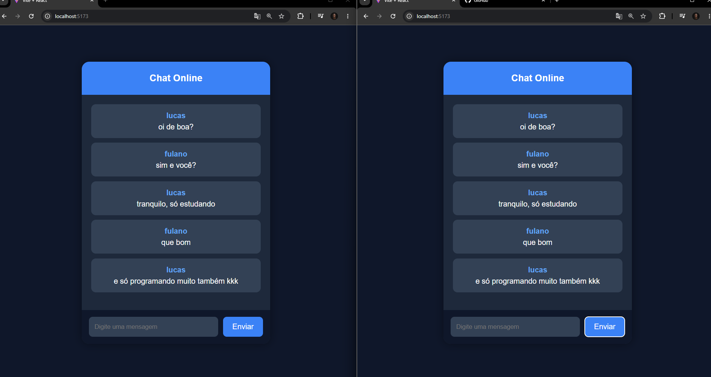
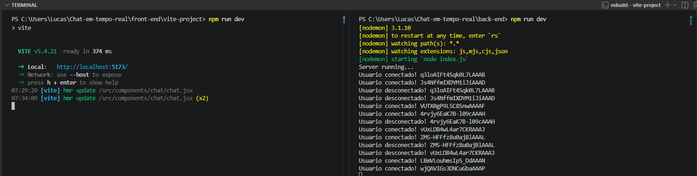

# 💬 Chat em Tempo Real

Aplicação de chat em tempo real desenvolvida com React, Node.js, Express e Socket.IO.

---

## 🚀 Tecnologias Utilizadas

- React
- Vite
- Node.js
- Express
- Socket.IO

---

## ✨ Funcionalidades

- Comunicação em tempo real
- Entrada com nome de usuário
- Atualização instantânea das mensagens
- Interface moderna e responsiva

---

## 📸 Preview



---

## ⚙️ Como executar o projeto

### 1. Clone o repositório

```bash
git clone <URL_DO_REPOSITORIO>